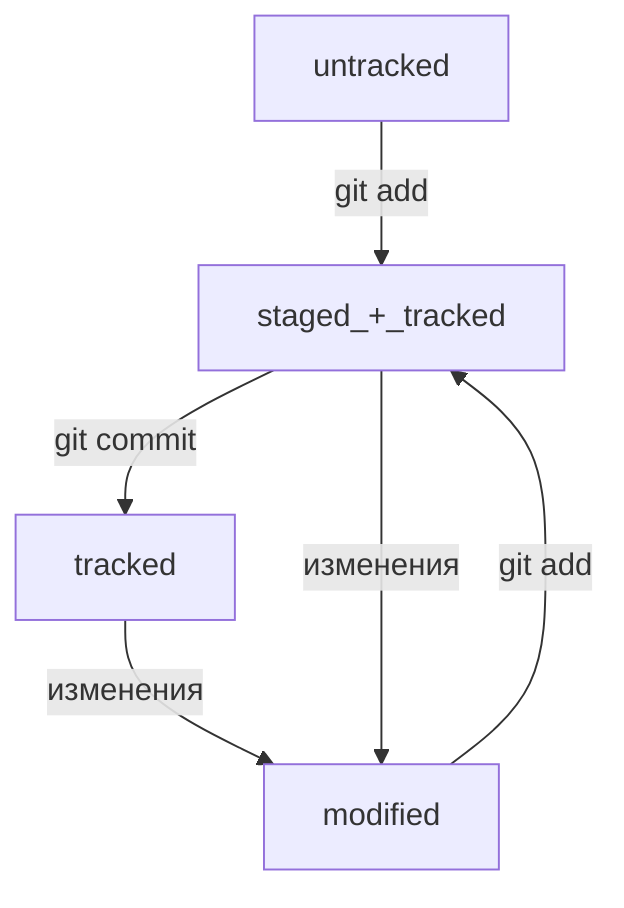

# Это шпаргалка по Git и GitHub

## Что такое Git

**Git** -- VCS система предназначенная для отслеживания изменений в программах,
текстовых файлах, документах и т.д.

Основные функции VCS:
1. хранить историю изменений в виде ревизий
2. манипуляция историей: возврат, изменение, удаление ревизий
3. анализ ищменений

## Консоль: установка и навигация

Если пользователь использует Linux или Mac -- установка консоли не требуется

Если пользователь использует Windows, требуется установить Git Bash с оффициального сайта
и установить с настройками по умолчанию.

### Команды для навигации в Git Bash:
---------------------------------
- *pwd* -- вывод текущей директории
- *cd* -- смена директории
- *ls* -- показать содержимое директории
- *ls -a* -- применение флага -a показывает все, в том числе скрытые файлы в директории
- *~* -- символ домашней директории
- *.* -- символ текущей директории
- *..* -- символ родительской директории
- *touch new-file.txt* -- создание файла 
- *mkdir new-dir* -- создание директории
- *mkdir -p dir1/dir2/dir3* -- создание дерева директорий
- *cp что куда* -- копирование файла в директорию
- *mv что куда* -- перемещение файла в директорию
- *cat file.txt* -- чтение текстового файла в консоль
- *rm file.txt* -- удаление файла
- *rmdir direction* -- удаление директории
- *rm -r* -- удаление папки со всем содержимым
- *rm -rf* -- удаление папки со всем содержимым с принуждением

### Команды для упрощения работы
----------------------------
- *&&* -- символ для выполнения двух команд за раз
- стрелки вверх/вниз -- вызов команды из буфера
- автозаполнение команды -- двойной Tab
- автозаполнение директории -- одинарный Tab


## Работа с Git

Чтобы создать репозиторий пишем команду

```bash
git init
```

Чтобы удалить репозиторий

```bash
rm -rf .git
```

Проверить статус репозитория

```bash
git status
```

Далее добавим файл к отслеживанию

```bash
git add <file>
git add --all
git add .
``` 

Далее проведем коммит

```bash
git commit -m "комментарий к коммиту"
```

Для просмотра истории коммитов

```bash
git log
```

## Работа с GitHub

Заходим на сайт GitHub и создаем новый репозиторий. Называем его так же, как и локальный

Подключать репозитории будем по SSH ключу. Проверить наличие SSH ключа в домашней директории

```bash
ls -la .ssh/
```

Если SSH ключ еще не создан, создаем его

```bash
ssh-keygen -t ed25519 -c "эл. почта привяз к GitHub"
```

### Привязываем SSH ключ к GitHub:
----------------------------------
1. Копируем содержимое публичного ssh ключа

```bash
clip <~/ssh/id_ed25519.pub
```

2. Перейти в настройки аккаунта GitHub
3. SSH and GPG keys
4. New SSH key
5. Название ключа
6. Keytype - Authentification Key
7. Вставить в Key скопированный ключ
8. Add SSH Key
9. Проверить правильность ключа командой

```bash
ssh -T git@github.com
```

### Привязываем локальный репозиторий к GitHub:
-----------------------------------------------
1. Скопировать SSH URL репозитория на GitHub
2. Открыть расположение репозитория и использовать команду

```bash
git remote add original URL
```

3. Убедиться, что репозтории связаны

```bash
git remote -v
```

## Синхронизация лок. и удал. репозитариев

Чтобы отправить изменения на удаленный репозиторий в первый раз используем команду

```bash
git push -u original master
```

Чтобы отправить изменения на удаленный репозиторий используем команду

```bash
git push
```

## Навигация по коммитам. Статусы файлов

### Хеш - идентификатор коммита
------------------------------

Хеширование - способ преобразовать набор данных и получить их "отпечаток".

Информация о коммите - когда, кем был создан, содержимое файлов и ссылка на родительский коммит.

Git хеширует информацию алгоритмом SHA-1:
1. хеш 40 знаков
2. состоит из символов 0-9 и A-F
3. хеш кардинально изменяется при малейшем изменении пакета информации

Git хранит таблицу Хеш -> Информация о коммите

Все хеши и таблица хранится в .git

### Исследуем лог
-----------------

Вызов команды выдает список коммитов от последнего к предыдущим

```bash
git log
```

Коммит содержит:
1. Хэш
2. Имя автора
3. Дату
4. Сообщение

Получить сокращенный лог:

```bash
git log --oneline
```

Эта команда выдает сокращенный хэш и сообщение к коммиту в одну строчку

Если выход из просмотра логов не произошел автоматически - нажать Q

### Файл HEAD
-------------

При вызове git log у последнего сообщения появляется сообщение HEAD -> master

Файл HEAD указывает на последний коммит. В нем содержится ссылка на него:
refs/heads/master

В файле по этой ссылке лежит хеш последнего коммита.

При работе с Git в команде часто в качестве входного аргумента принимается ссылка, в частности ссылка HEAD

### Статусы файлов в Git
------------------------

Файлы в Git могут иметь статусы:
1. untracked - файл, который Git видит, но не оттслеживает
2. staged - файл, который попадет в коммит
3. tracked - файл, в котором Git отслеживает изменения (уже закоммиченный или только добавленный)
4. modified - файл, в котором Git нашел отличия от последней сохраненной версии

#### Примерная схема жизни файла

